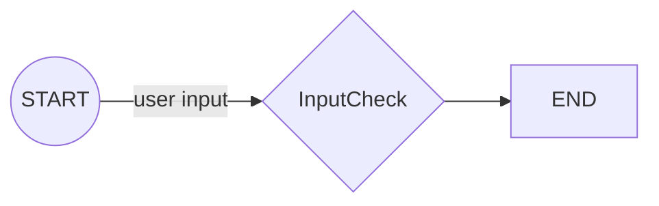
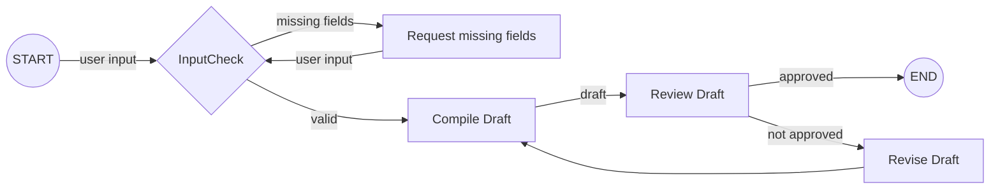

# Goal

- Scaffold a new LangChain project.
- Follow the instructions in the LangChain documentation (LC Doc): https://docs.langchain.com/oss/python/langgraph/quickstart

Steps:
Scaffold the project in src/demo

src/demo/graph/
1. init an openai model
2. define a message state according to (LC Doc)
3. define a model node according to (LC Doc)
4. no need to define a tool node
5. define a small graph

6. add to the graph state the following dictionaries:
- `input`: load json from data/input.json
- `structure`: load json from templates/review_format.json
- `qualifiers`: load json from templates/qualifiers.json 
- `draft`: empty dictionary
- `manager_id`: manager_id from input

src/demo/utils/
1. load prompts from JSON files in src/prompts (field `prompt`)

Guidelines:
- just implement only what I ask you to implement
- don't add any additional code
- don't add any additional data or prompt files
- don't add any additional dependencies

src/demo/tools/
1. implement the tool `validate_input`:
given data (from: src/demo/utils/loader.py:load_data and data/input.json) it checks:
- the fields `manager_id`, employee, rating, manager_bullets are not empty.
- manager_bullets must have at list len>=3
- the elements of manager_bullets must have the fields `text` and `rating`
- rating must be in the Enum field of docs/templates/qualifiers.json

# Long term goal

As a reference, don't implement now

